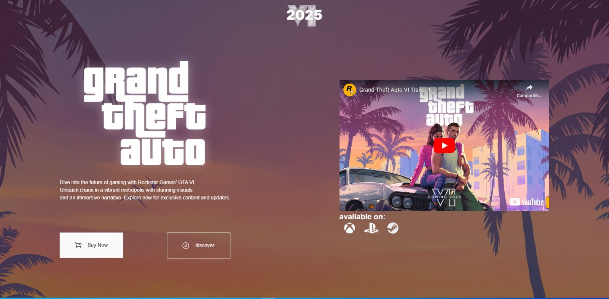

# Landing Page do GTA 6

## Descrição do Projeto
Este projeto consiste em uma landing page responsiva para o GTA 6. A página foi desenvolvida utilizando HTML, CSS e JavaScript para proporcionar uma experiência interativa e envolvente aos visitantes.

## Características
- **Design Responsivo:** A página é otimizada para exibição em uma variedade de dispositivos, desde smartphones até desktops.
- **Interatividade:** Elementos interativos, como animações e transições, foram incorporados para melhorar a experiência do usuário.
- **Tecnologias Utilizadas:**
  - HTML5
  - CSS3
  - JavaScript

## Pré-requisitos
Certifique-se de ter um navegador web moderno instalado para visualizar a página corretamente.

## Como Usar
1. Clone ou faça o download do repositório.
2. Abra o arquivo `index.html` em um navegador web.

## Estrutura do Projeto
